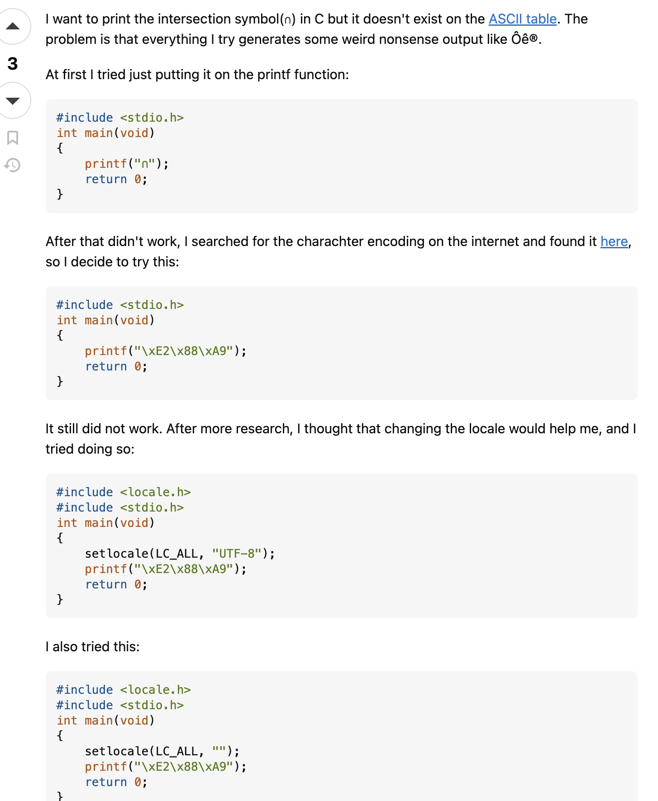
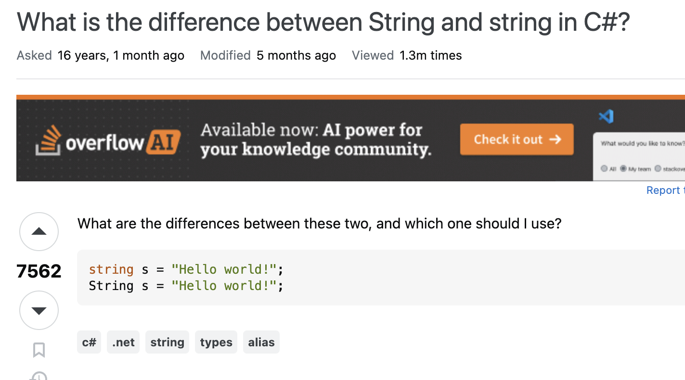

## Smart Questions

I think it's funny how teachers often say 'There are no dumb questions' when trying to make students engage in class. Unfortunately Eric Raymond puts that saying to extinction in his article: [How To Ask Questions The Smart Way](http://www.catb.org/esr/faqs/smart-questions.html). In his article he explains that a smart question consists of taking steps before even asking the question.

These steps included: 

1. Trying to find the answer from archives of forums or mailing lists.
2. Trying to find the answer on your own from the Web.
3. Trying to find the answer by reading the manual.
4. Look for the answer in FAQ.
5. Try to find the answer by inspection or experimentation.
6. Try ask a skilled friend.
7. Try read a source code for the answer.

In any question, you want to show evidence that you tried your best looking for the answer on your own prior to asking for help. This makes you look more credible and not 'lazy'. This [example](https://stackoverflow.com/questions/59116815/how-do-i-print-%e2%88%a9-in-c-language) from Stack Overflow perfectly exemplifies how a smart question should be asked. You can tell this person took many measures to look for the answer on their own. The question portrays the whole process of going through trial and error 

  

## Not So Smart Questions
Not so smart questions are just questions without any effort attempted. It can also be the environment the question is being asked in. For example asking a question about dogs in Computer Science class is very redundant. But specifically what defines a not so smart question is the way it is asked. If there is no evidence or background information of what the person tried to do on their own before asking, it is considered as dumb and lazy.

In this Stack Overflow [example](https://stackoverflow.com/questions/7074/what-is-the-difference-between-string-and-string-in-c) this person asks a question without showing any of the steps before asking a question. Unlike the other example, this person does not include any attempts they have tried prior to posting this question. Unfortunately this makes the question an example of a not so smart question because it looks like no effort and prior knowledge was put in. 

## Conclusion
I thought Raymonds article was interesting. He explained that you should not ask for answers in private email. It was interesting to hear that it is better to post it publicly when possible because many helpers can feel rewarded. It made me understand why the current class I am taking prefers questions to be asked in our class discord versus emails directly to our professors. As I got enlightened by what a smart question was, I heavily admitted guilty to being an active 'Not so smart question' asker. But now I know how these dumb questions can be percieved. Overall I learned that the type of question as well as how you ask the question is very important. Explaining your thought process and what you tried so far helps the person answering understand your thought process. It also proves that you tried your best in searching for the answer on your own. The chances of getting a more detailed and accurate answer is higher when a smart question is formulated rather than a dumb one. This made a lot of sense to me, if someone were to just ask "how do you do this?" rather than "I tried this... and this.. but keep getting this problem.." I can see the big difference in attitude recieving these questions. 
