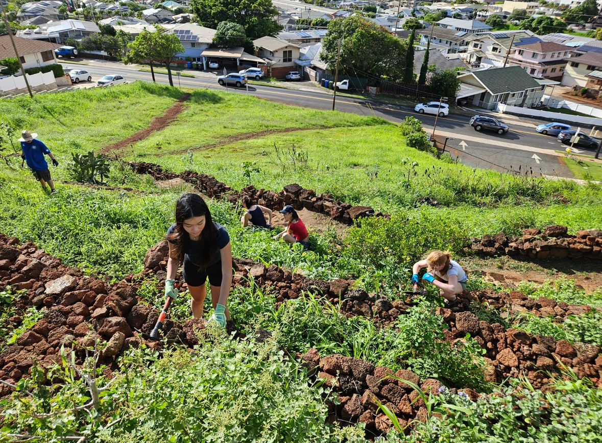

My idea of people waking up before the sun rose to go to the gym always seemed inspirational to me. Although I've had my fair share of gym attempts, it was difficult for me to create it as a routine. My dad and sisters started going to Kokohead every Sunday morning for sunrise. Reaching the top as the sun woke up with you was the best feeling ever. The fresh new wind of the day cooling you from your hard worked sweat. From that day the routine began. Every sunday morning we would hike Kokohead together, and rush home to get ready to go to my part time job. It made me feel accomplished!

School started and my schedule shifted a bit. I managed to get one of my good friends and create a 50 day kokohead challenge. Every tuesday morning before our 9 AM class we'd hike Kokohead. The 1048 stairs of doom made me feel confident and productive. Everyone has 24 hours, I found it so accomplishing that I was up and early beign active to start my day. This made my days go longer as well! Soon we began to time ourselves breaking our records one after another. 

Overall I think this little personal challenge that I made helped me get in a better habit of exercising. It also made me realize how much time we have and are wasting. This challenge made me more aware of how valuable our 24 hours are. 

<pre>

