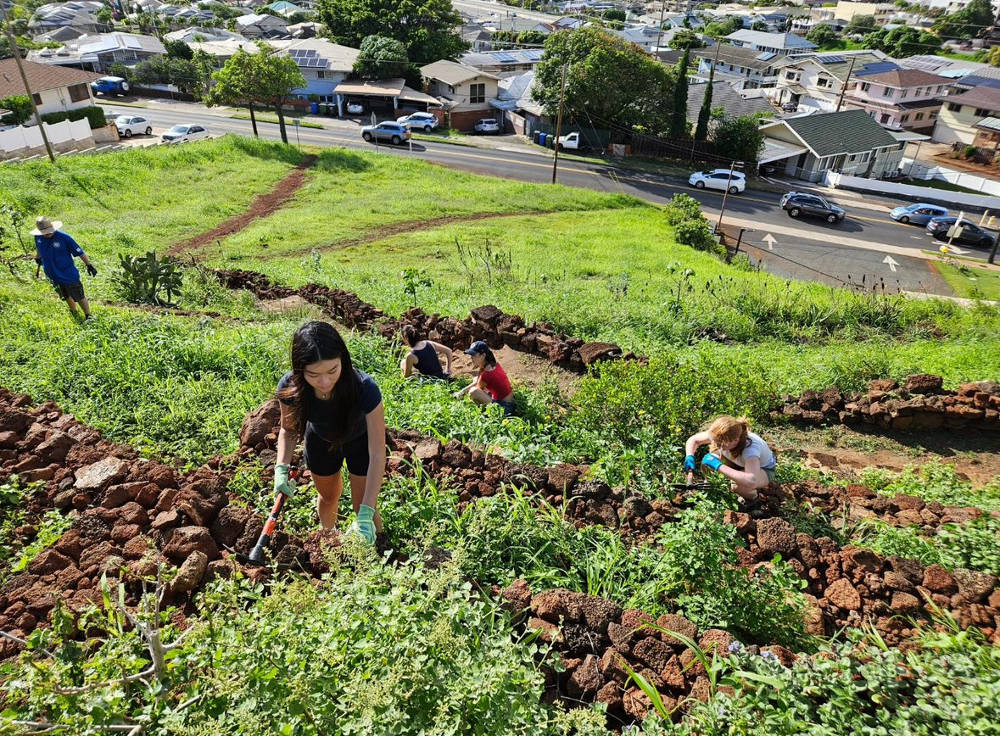

During the Summer I contributed volunteering with 808 cleanups. [808 Cleanups](https://808cleanups.org/)
We'd meet once a week at Pu`uo Kaimuki park and divide into groups. Each person would have their own responsibility in restoring the park. From stacking cement rocks to create a cleaner wall, remove trash, rocks, or trim trees. I usually had the responsibility of weeding out invasive species of weeds. That way it would make space for Native plants to prosper. 

I learned alot about the different plant species and now I am able to detect the invasive species and remove them when I can. It was interesting to find out that many of the common plants I see were invasive species

I'm really glad I got to experience being involved in this volunteer restoration. I always go to this park when I need some fresh air watching the sunset, or watching the christmas tree light up with my friends and family. So it was really nice to give back the not only my neighborhood but the park that I love. 

<pre>

